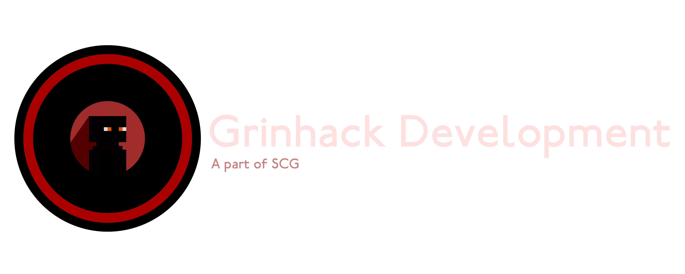
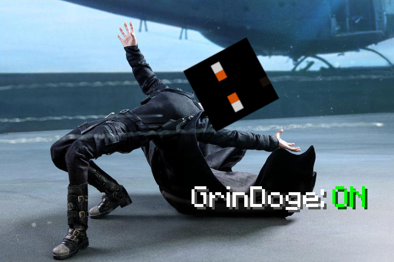

    

We are a leading group of developers specialising in creating multiplayer utilities for vanilla Minecraft gameplay. Responsible for GrinUtils for basehunting (now in Grinhack), Meteor-BlueMap integration, and the 1.21.1 liquid updater exploit.

    

### Public tools

|Name|Description|Repo|Wiki|
|---|---|---|---|
|Merlin|Message based Discord bot and coords management system.|[siriusmart/merlin](https://github.com/siriusmart/merlin)|[github.io](https://siriusmart.github.io/merlin)|
|GM Blue|3D world download previewer with authentication.|[gmornin/blue](https://github.com/gmornin/blue)|N/A|

 

Grinhack Development is a part of SCG

